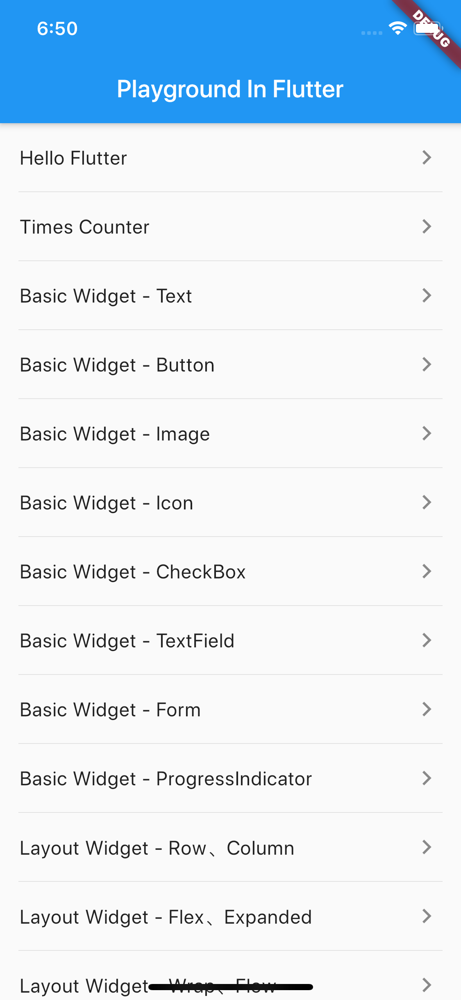

  <h3 align="center">playground_in_flutter</h3> 
  

     该工程为 Flutter 学习过程中 各种组件&功能演示示例的笔记，其中多数示例 参考自
     <a href="https://book.flutterchina.club">《Flutter 实战》</a> 。
      
     
    <a href="https://github.com/AndyM129/PlaygroundInFlutter/issues/new?template=bug_en.md">Report bug</a>
    ·
    <a href="https://github.com/AndyM129/PlaygroundInFlutter/issues/new?template=feature.md&labels=feature">Request feature</a> 
  

 
 

### App Preview

<table>
<tr height="60px" align="center">
  <td width="20%"><strong>Example</strong></td>
  <td width="80%"><strong>Screenshots</strong></td>
</tr>
<tr align="center" height="120px">
  <td>Home</td>
  <td></img></td>
</tr>
</table>
